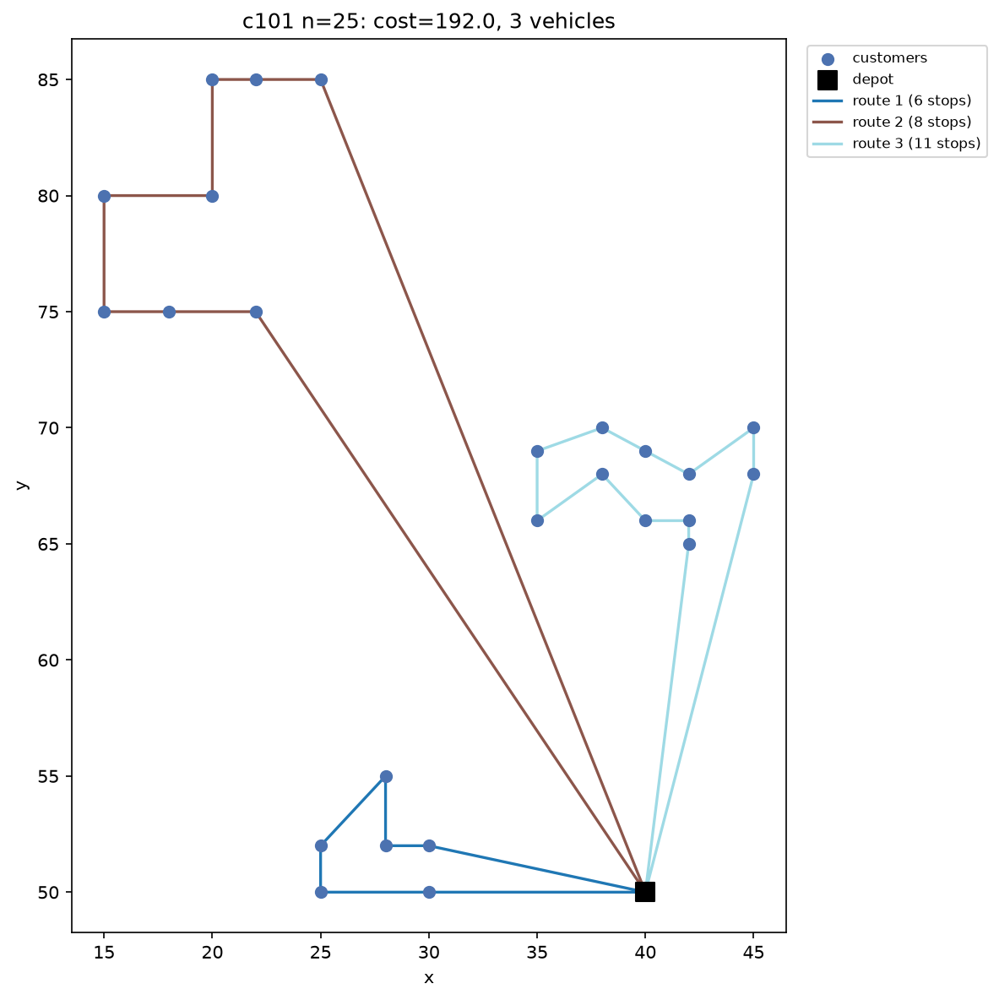

# VRPTW Branch-and-Price

[](https://github.com/Hussmart/vrptw-branch-and-price/actions/workflows/tests.yml)
[](LICENSE)


An exact solver for the **Vehicle Routing Problem with Time Windows (VRPTW)**
built around **Branch-and-Price**: Dantzig-Wolfe column generation with an
**ng-route relaxation** pricing algorithm, wrapped in a branch-and-bound
layer that closes the integrality gap and *proves* optimality (not just a
good heuristic number).

This started as a fork of
[`SimoneRichetti/VRPTW-Column-Generation`](https://github.com/SimoneRichetti/VRPTW-Column-Generation),
which solved only the LP relaxation of the set-partitioning master problem.
The original code is preserved under [`legacy/`](legacy/); everything under
[`vrptw_cg/`](vrptw_cg/) is a new implementation. See
[`GAP_ANALYSIS_AND_ROADMAP.md`](GAP_ANALYSIS_AND_ROADMAP.md) for a detailed,
file-by-file account of what changed and why, and
[`docs/REPORT.md`](docs/REPORT.md) for the full technical writeup
(formulation, algorithms, complexity, and validation).

<p align="center">
  
</p>

## What "exact" means here

Column generation alone only gives a **lower bound** and a generally
fractional LP solution. This project adds the missing branch-and-bound
layer on top (Barnhart et al., 1998), so the number it reports is a
certified integer optimum -- or, if a time/node budget is hit, a feasible
solution together with a proven lower bound and optimality gap.

Correctness is checked three ways, not just asserted:

1. **Dual-feasibility tests** (`tests/test_master.py`) verify the LP
   optimality condition (every column's reduced cost `>= 0` at the optimum)
   against SciPy's HiGHS backend directly -- this is what catches a sign
   error in the reduced-cost formula before it silently breaks column
   generation.
2. **An independent bitmask-DP brute-force solver**
   (`tests/test_branch_and_price.py`), unrelated to column generation, is
   used as ground truth on small instances, for both the plain and the
   lexicographic objective (see below). Branch-and-Price matches it exactly
   on every tested case.
3. **A stabilization correctness test**: dual-value smoothing (used to
   accelerate convergence) is checked to always reach the exact same
   certified optimum as no smoothing at all -- it is only ever an
   acceleration, never a shortcut on correctness.

## Quickstart

```bash
git clone https://github.com/Hussmart/vrptw-branch-and-price.git
cd vrptw-branch-and-price
pip install -r requirements.txt          # numpy, scipy, matplotlib, pytest -- no license needed
python -m vrptw_cg.cli --instance c101 --customers 25 --plot
```

```
Loaded c101 with 25 customers (K=25 vehicles, Q=200 capacity)
Status: optimal
Best solution cost: 192.00
Proven lower bound: 192.00 (gap 0.000%)
Vehicles used: 3
Time: 26.8s (limit 180s)
```

The standard Solomon-benchmark objective (minimize the fleet size first,
then distance -- see "Two objectives" below):

```bash
python -m vrptw_cg.cli --instance c101 --customers 25 --objective vehicles-then-distance
```

Batch benchmark across the Solomon suite:

```bash
python -m vrptw_cg.benchmark --instances c101 r101 rc101 --customer-counts 10 25
```

Run the test suite (31 tests, ~10 seconds, including the end-to-end
brute-force validation):

```bash
pytest
```

## Two objectives

The original project minimized distance only, and never actually enforced
the fleet-size bound it accepted as a parameter (see
`GAP_ANALYSIS_AND_ROADMAP.md`) -- so its numbers cannot be compared against
published Solomon-benchmark tables, which use a **lexicographic** objective:
minimize the number of vehicles first, then minimize distance among
solutions using that minimum fleet. This project supports both, explicitly:

* `--objective distance` (default): minimize distance subject to
  `sum(y_r) <= K`.
* `--objective vehicles-then-distance`: `vrptw_cg.branch_and_price.solve_lexicographic`
  runs two independent Branch-and-Price solves -- phase 1 minimizes vehicle
  count (every route costs exactly 1), then phase 2 minimizes distance with
  the fleet size capped at that proven minimum. Both phases are exact; both
  are validated against the brute-force oracle
  (`test_lexicographic_objective_matches_bruteforce_oracle`).

No "literature best-known" values are hardcoded anywhere in this repository:
the classic reference page for the 25/50-customer Solomon subsets
(`web.cba.neu.edu/~msolomon`) is currently unreachable (link rot on a
decades-old academic page), and quoting a specific number from memory
without being able to verify it would be worse than not quoting one at all.
`vrptw_cg/benchmark.py --reference-csv` accepts your own verified numbers
(e.g. from running [PyVRP](https://github.com/ortec/PyVRP) or
[VRPSolverEasy](https://github.com/inria-UFF/VRPSolverEasy) yourself, or
from a paper you can cite) and reports the gap against them automatically.

## Column generation acceleration: dual stabilization

Plain column generation is notorious for "tailing-off": many late iterations
that each shrink the LP bound by a tiny amount. This project implements
dual-value smoothing (du Merle et al., 1999): pricing is first tried with a
weighted blend of the current and a running "stability center" dual vector;
if that fails to find an improving column, the *exact* current duals are
always re-tried before declaring convergence. That fallback is what keeps
this a pure acceleration with zero effect on the final answer --
`test_stabilization_does_not_change_the_optimal_answer` checks exactly that.

## Results

Both objectives solve to a **certified optimum** (proven lower bound equals
the reported cost, `gap_percent = 0.000%`) on all 12 tested Solomon
instances spanning all three classes (clustered `c`, random `r`, mixed `rc`)
and both time-window widths ("1" narrow, "2" wide):

| objective | instances solved to certified optimum | full data |
|---|---|---|
| `distance` | 12 / 12 | [`results/benchmark.csv`](results/benchmark.csv) |
| `vehicles-then-distance` | 12 / 12 | [`results/benchmark-lexicographic.csv`](results/benchmark-lexicographic.csv) |

The two objectives are not interchangeable: on `c201`/25 customers,
minimizing distance alone uses 2 vehicles for a cost of 217.00, while the
literature-standard lexicographic objective is forced to 1 vehicle at a
*higher* cost of 297.00 -- see `docs/REPORT.md` Section 9 for the full
comparison and discussion, including the one case (`rc201`/25, 671.7s) where
proving the minimum feasible fleet size was the computational bottleneck.

## Why this is different from the original project

| | `legacy/` (original) | `vrptw_cg/` (this fork) |
|---|---|---|
| Integrality | LP relaxation only, rounded with a greedy heuristic | Full Branch-and-Price -- certified integer optimum |
| Pricing subproblem | Non-elementary resource DP; can revisit a customer | ng-route relaxation label-setting (Baldacci et al., 2011) |
| Fleet-size constraint | Accepted as a parameter but never enforced | Enforced, and branched on (Desrochers-Desrosiers-Solomon, 1992) |
| Objective | Distance only | Distance, or the standard lexicographic (vehicles, then distance) |
| CG convergence | Plain column generation, no acceleration | Dual-value stabilization (du Merle et al., 1999), correctness-tested |
| Solver | Gurobi only (license required) | Free HiGHS backend by default; Gurobi optional |
| Interface | Interactive `input()`, one instance at a time | CLI + batch benchmark script |
| Visualization | None (a TODO in the original code) | Route maps and convergence plots |
| Tests | None | 31 unit tests + independent brute-force validation + CI |

## Solver architecture

```
vrptw_cg/
  data.py              instance loading, distance matrix, time-window reduction, ng-route neighbor sets
  master.py            set-partitioning LP relaxation (SciPy/HiGHS, optional Gurobi), with artificial
                        variables so every branch-and-price node is always LP-feasible
  pricing.py           ng-route relaxation label-setting algorithm (the column generation subproblem)
  branch_and_price.py  the branch-and-bound layer: vehicle-count branching, arc branching, and
                        Ryan-Foster branching as the provably complete fallback; dual stabilization;
                        solve_lexicographic() for the two-phase vehicles-then-distance objective
  heuristics.py        IMPACT construction heuristic, used only to seed the root node
  visualize.py         route maps and column-generation convergence plots
  cli.py               command-line entry point
  benchmark.py         batch runner across the Solomon benchmark
```

## On using ORTEC

ORTEC is a commercial logistics-optimization vendor; its production solver
is closed-source with no public API, so it cannot be embedded here directly.
What *is* real and used as a reference point in `docs/REPORT.md`: ORTEC
maintains an [open-source fork of PyVRP](https://github.com/ortec/PyVRP)
(MIT license, first place in the DIMACS VRPTW 2021 and EURO meets NeurIPS
2022 competitions) and has organized several real-data academic competitions
(the VeRoLog Solver Challenges, and EURO meets NeurIPS 2022). Those are the
legitimate, citable way to benchmark this solver against both industrial
practice and the current open-source state of the art.

## References

* M. Desrochers, J. Desrosiers, M. Solomon, "A New Optimization Algorithm for
  the Vehicle Routing Problem with Time Windows", *Operations Research*, 1992.
* C. Barnhart et al., "Branch-and-Price: Column Generation for Solving Huge
  Integer Programs", *Operations Research*, 1998.
* R. Baldacci, A. Mingozzi, R. Roberti, "New route relaxation and pricing
  strategies for the vehicle routing problem", *Operations Research*, 2011.
* D. Ryan, B. Foster, "An integer programming approach to scheduling", 1981.
* O. du Merle, D. Villeneuve, J. Desrosiers, P. Hansen, "Stabilized column
  generation", *Discrete Mathematics*, 1999.
* R. Sadykov, E. Uchoa, A. Pessoa, "A Bucket Graph Based Labeling Algorithm
  with Application to Vehicle Routing", *Transportation Science*, 2021.
* N. A. Wouda, L. Lan, W. Kool, "PyVRP: A High-Performance VRP Solver
  Package", *INFORMS Journal on Computing*, 36(4), 943-955, 2024.
* G. Ioannou, M. Kritikos, G. Prastacos, "A greedy look-ahead heuristic for
  the vehicle routing problem", *JORS*, 2001 (the IMPACT heuristic used to
  seed the root node).
* M. Solomon, "VRPTW Benchmark Problems", http://web.cba.neu.edu/~msolomon/problems.htm

See `NOTICE.md` for the fork's provenance and `LICENSE` for terms.
